# Mohamed Aziz Achour  
**Software Engineer — Backend, AI & Systems**

💡 Building **AI-powered systems, industrial applications & intelligent automation**  
⚙️ From embedded systems to full-stack AI platforms  

📍 Tunisia  
🔗 GitHub: https://github.com/Medazizachour  
🔗 LinkedIn: https://linkedin.com/in/aziz-achour-250181178

---

## 🧠 About Me

Software Engineer with 3+ years of experience delivering **production-grade systems** 
in industrial environments.

I specialize in:

- **Backend & real-time systems**
- **AI & Computer Vision**
- **Chatbots & business automation**
- **Embedded systems & robotics**

✔️ Built biometric authentication systems  
✔️ Developed real-time production tracking tools  
✔️ Delivered industrial web applications  
✔️ Designed AI-powered chatbots for business  
✔️ Built fully responsive eCommerce websites  

---

## 🔥 Featured Projects

---

## 🛍️ Fashion E-Commerce Website

A modern, fully responsive **fashion eCommerce website** with a clean UI,
smooth navigation, and complete shopping experience.

### 📸 Preview

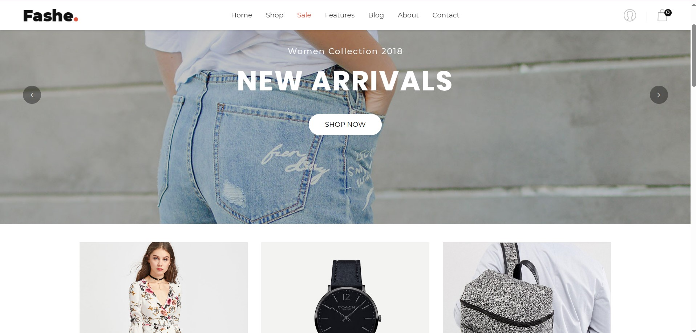
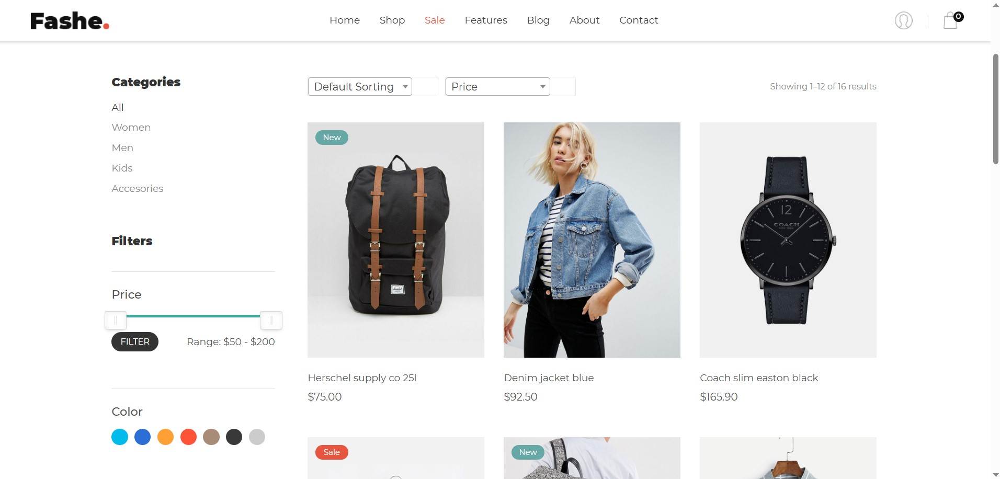
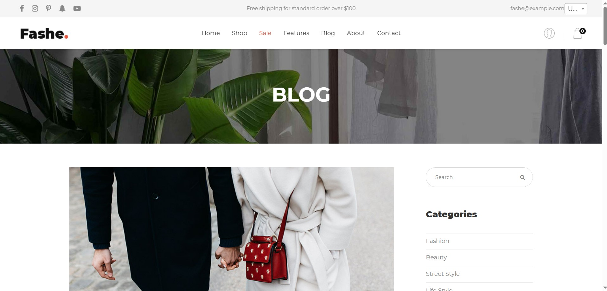

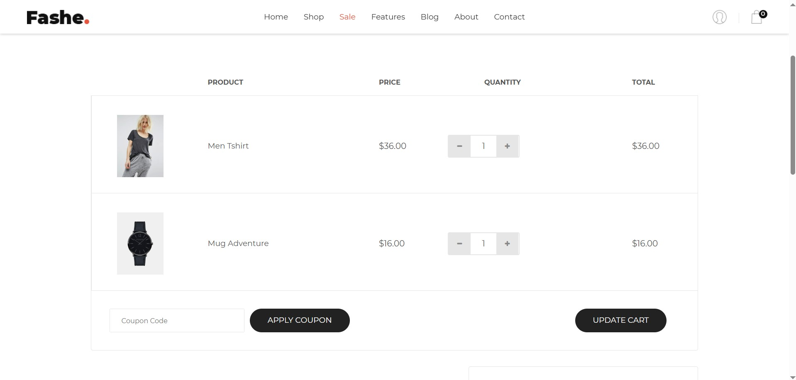
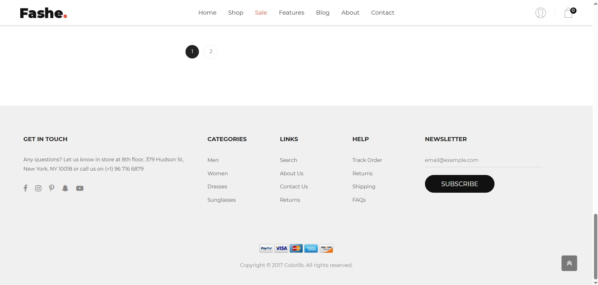
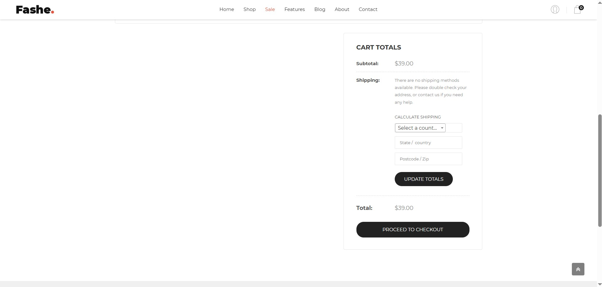
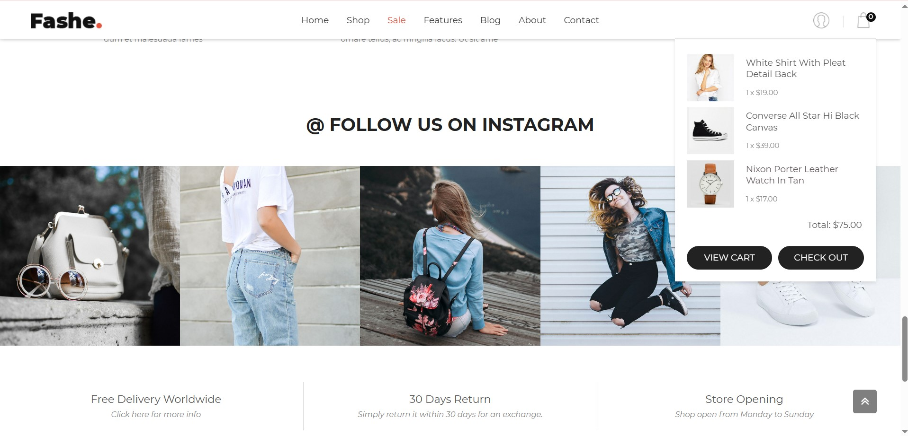
### ⚙️ Features

- 🛒 Product listing with category filtering
- 🔍 Product detail pages with image gallery
- 🛍️ Shopping cart functionality
- 📱 Fully responsive (Mobile / Tablet / Desktop)
- 🎨 Clean and modern UI/UX design
- 📧 Newsletter subscription section
- 🔥 Promotional banners and featured collections
- ⚡ Optimized performance and fast loading

### 🎯 Impact

✔️ Smooth and intuitive customer journey  
✔️ Mobile-first design approach  
✔️ Improved product discoverability  
✔️ Higher conversion-focused UI layout  

### 🛠️ Tech Stack

`HTML5` • `CSS3` • `JavaScript` • `Bootstrap` • `Responsive Design`

---

## 🤖 AI E-Commerce Chatbot  

An intelligent AI chatbot designed for **e-commerce customer support**,
optimized for user experience.
### 📸 Preview

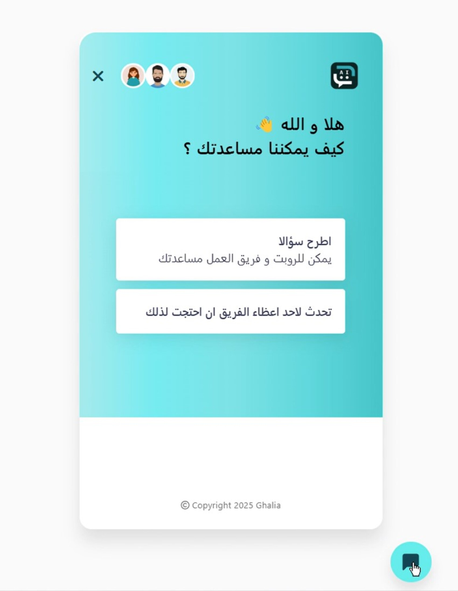
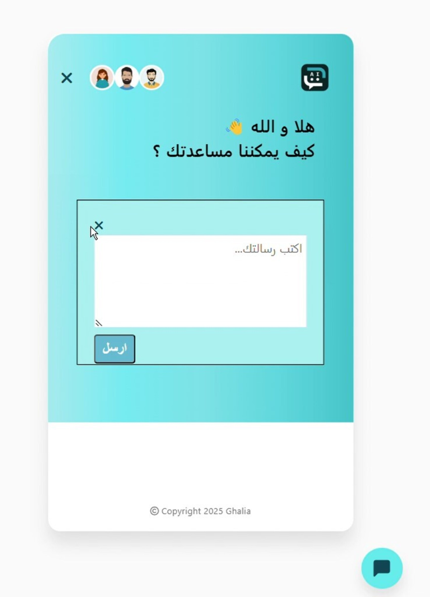
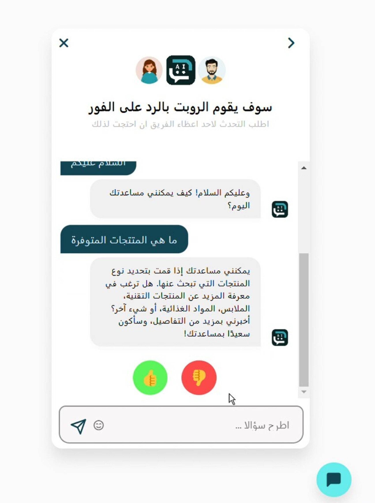
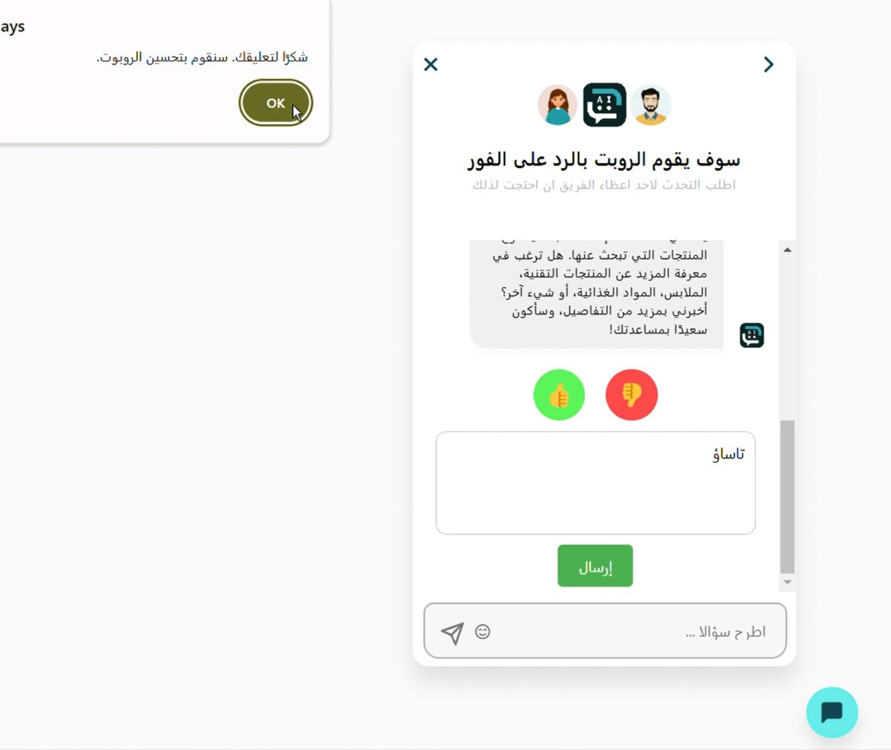

### ⚙️ Features

- 🧠 **Intent Detection (NLP)**
- 🔀 **Smart routing (Bot → Human agent)**
- 💬 Interactive UI (animations + emoji)
- 👍 AI feedback system (continuous improvement)
- 📱 Mobile-first & high performance
- 🌍 Full RTL Arabic support

### 🎯 Impact

✔️ Faster response time  
✔️ Reduced manual support workload  
✔️ Increased customer satisfaction (CSAT)  
✔️ Improved e-commerce conversion rate  

### 🛠️ Tech Stack

`React / Vue` • `Node.js` • `OpenAI / Dialogflow` • `n8n` • `Tailwind CSS`

---

## 🏭 Smart SMT Production Web App

🔗 **Repo:** https://github.com/aziz-achour/your-smt-project  

Industrial web application for **SMT production line management**.

### ⚙️ Features

- Multi-protocol communication (CSV, REST, Shared Folder)
- Real-time production dashboard
- Auto quantity updates
- Low stock alerts

### 🛠️ Tech Stack

`Python Flask` • `Sockets` • `SQL Server` • `JavaScript`

---

## 🔐 Bio – Biometric Authentication System

🔗 **Repo:** https://github.com/Medazizachour/biometric_app  

Secure web-based biometric authentication system designed for 
industrial access control.

### ⚙️ Features

- Designed SQL Server database schema  
- Developed REST APIs (user / line / machine CRUD)  
- Integrated Futronic fingerprint SDK:
  - Enrollment  
  - 1-to-N fingerprint verification  
- Implemented Role-Based Access Control (Operator / Engineer / Service)  
- Built secure TCP socket client with retry & error handling  
- Implemented encrypted configuration management  
- Performed end-to-end testing across dev/test/prod environments  

### 📸 Preview

### 🛠️ Tech Stack

`Python` • `Javascript` • `SQL Server` • `TCP/IP` • `HTML/CSS` • `Figma`

---

## 🎥 Secure CCTV Streaming System

🔗 **Repo:** https://github.com/aziz-achour/your-cctv-project  

Secure real-time video streaming system.

### ⚙️ Features

- RTSP streaming
- AES/RSA hybrid encryption
- HMAC-SHA256 integrity check
- Multithreaded pipeline

---

## 🤖 Autonomous Robot + AI Vision

🔗 **Repo:** https://github.com/aziz-achour/your-robot-project  

Autonomous robot with computer vision and navigation.

### ⚙️ Features

- Path-planning algorithms
- OpenCV + PyTorch vision
- PID motion control
- Custom PCB + mechanical design

---

## 💼 AI Chatbot & Automation Solutions

### 🟢 Basic Customer Support Bot

- 24/7 automated replies  
- WhatsApp / Messenger integration  
- Simple dashboard  

---

### 🔵 Meta Business Automation Bot

- Facebook & Instagram automation  
- Lead qualification  
- CRM integration (Sheets / Airtable)  
- Automated follow-ups  

---

### 🟣 HR & Recruitment Bot

- CV screening  
- Candidate Q&A automation  
- Interview scheduling  
- Candidate database  

---

### 🟡 E-Commerce AI Chatbot

- AI + human agent hybrid system  
- Smart product recommendations  
- Premium RTL UX  
- Built-in feedback system  

---

### ⚙️ Custom Bots (On Demand)

- Real estate  
- Medical  
- Education  
- Legal  
- Internal AI assistants  

---

## 🧰 Tech Stack

### 💻 Backend
- Python (Flask)
- Node.js
- REST APIs / WebSockets

### 🧠 AI & Automation
- OpenAI GPT
- Dialogflow
- n8n / Zapier / Make

### 🗄️ Databases
- PostgreSQL
- SQL Server
- SQLite

### ⚙️ Systems & Embedded
- STM32 / ESP32 / Raspberry Pi  
- FreeRTOS  
- TCP/IP / Encryption  

### 🎨 Frontend
- React / Vue  
- HTML5 / CSS3 / Bootstrap
- Tailwind CSS  

---

## 📊 What I Bring

| Skill | Level |
|-------|-------|
| 🧠 AI & Machine Learning | ⭐⭐⭐⭐⭐ |
| ⚙️ Backend Development | ⭐⭐⭐⭐⭐ |
| 🌐 Web Development | ⭐⭐⭐⭐⭐ |
| 🔐 Security & Encryption | ⭐⭐⭐⭐ |
| 🤖 Embedded Systems | ⭐⭐⭐⭐ |
| 🎨 UI/UX Design | ⭐⭐⭐⭐ |

- 🧠 AI + Engineering mindset  
- ⚙️ Industrial-grade experience  
- 🚀 Production-ready systems  
- 💡 Strong problem-solving skills (hardware + software)  

---

## 📫 Contact

📧 mohamedaziz.achour@enicar.u-car.tn  
📞 +216 29 007 200  
🔗 GitHub: https://github.com/Medazizachour  
🔗 LinkedIn: https://linkedin.com/in/aziz-achour-250181178  

---

## ⭐ Let's Build Something Powerful

If you want to:

- 🛒 Build a professional eCommerce website
- 🤖 Automate your business with AI  
- ⚙️ Integrate AI into your systems  
- 🚀 Build scalable tech products  

👉 Feel free to reach out!

---

> *"Engineering is not just about writing code — 
> it's about solving real problems with smart solutions."*  
> — **Mohamed Aziz Achour**
